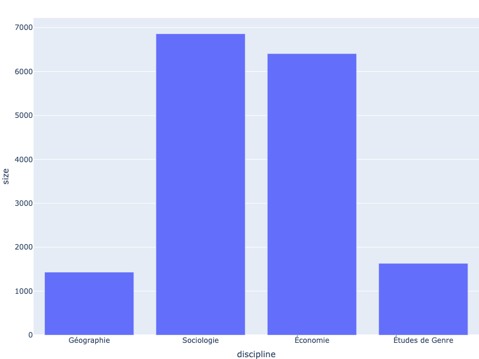

# Introduction
## Objectifs de la leçon
Cette leçon montre comment créer des visualisations de données interactives avec la bibliothèque *open-source* **Plotly**. En particulier, vous apprendrez :
- La différence entre **Plotly Express**, **Plotly Graph Object** et **Plotly Dash**
- Comment créer et exporter des visualisations à l'aide de `plotly.express` et `plotly.graph_objects`
- Comment personnaliser vos visualisations

## Les prérequis
Afin de pouvoir suivre la leçon, il est nécessaire d'avoir :
- installé python 3 et le gestionnaire de paquets (*package*) `pip`
- un niveau de compréhension intermédiaire du language de programmation Python.
- une connaissance générale des bibliothèques `pandas` et `numpy` (ces deux bibliothèques doivent être installées).
- une connaissances de quelques techniques de base de visualisation de données (en particulier les histogrammes, les diagrammes en barres et les nuages de points)
- Des notions de traitement des données (nous utiliserons `pandas`)

## Qu'est ce que Plotly ? 
**Plotly** est une société qui fournit un certain nombre de bibliothèques *open source* permettant aux utilisateurs de construire des visualisations interactives. Celles réalisées avec Plotly se démarquent des images statiques de par leur interactivité, à l'aide de boutons, d'outils pour se déplacer et zoomer, de représentations en mosaïque et bien plus encore. Les bibliothèques Plotly sont disponibles à la fois en Python - le sujet de cette leçon - ainsi que dans d'autres languages de programmation comme R et Julia. Les librairies de Plotly permettent de réaliser une large variété de visualisations et ce à de nombreuses fins : statistiques, scientifiques, financières ou géographiques. Ces visualisations peuvent être affichées de plusieurs manières : à travers des *notebooks Jupyter*, des pages web (HTML) ou dans des applications web développées avec l'environnement **Dash** de Plotly. Il est aussi possible d'exporter les visualisations sous formes d'images statiques (non interactives) en pixels (*raster*) ou en vectoriel ou vectorielles.

> Tout le long de cette leçon, les graphes générés à l'aide de Plotly seront affichés comme des images statiques. Pour utiliser les fonctionnalités intéractivesm il faudra cliquer sur l'image ou bien le lien dans la descritption de l'image.

## Plotly, une Librairie Graphique de Python : Plotly Express vs Plotly Graph Objects vs Plotly Dash

Afin de comprendre comment utiliser Plotly, il est fondamental de comprendre les différences entre Plotly Express, Plotly Graph Objects et Plotly Dash.

Il s'agit essentiellement de 3 modules distincts - dont les fonctionnalités peuvent se superposer - qui ont leurs propres objectifs :

- **Plotly Express** (`plotly.express` souvent importé avec l'alias `px`) est une interface de représentation graphique de haut niveau, facile à prendre en main, et qui permet de créer près de 30 différents types de graphes. Le module fournit des fonctions permettant de créer des graphes avec une seule ligne de code (bien que plusieurs lignes de code sont nécessaires à la personnalisation de certains éléments), rendant les graphes rapides et faciles à créer. Puisque `plotly.px` est une interface "de haut niveau", cela signifie que l'utilisateur.ice n'a pas besoin de s'attarder sur la structure sous-jacente des graphes. Plotly recommende aux débutant.e.s de commencer avec Express avant de travailler avec Plotly Graph Objects.

- Les objets graphiques de Plotly - associés aux module **Plotly Graph Objects** (`plotly.graph_objects` souvent importé avec l'alias `go`) sont les véritables objets que Plotly créé lorsque l'on fait appel à Plotly Express. Plotly génère des Graph Objects pour garder en mémoire les données du graphe. Ces données incluent les informations à visualiser avec de nombreux autres attributs telles que les couleurs, formes et tailles des objets. Il est alors possible de créer une visualisation plus finement en avec Plotly Graph Objects. Il est d'ailleurs possible de recréer n'importe quelle figure créée par Plotly Express à l'aide de Plotly Graph Objects. Il est, en général, recommendé d'utiliser Plotly Express là ou c'est possible pour réduire le nombre de lignes de code. En revanche, comme nous le verrons par la suite, le recours seul à Plotly Express est impossible et il faudra nécessairement passer par Plotly Graph Objects.

- Le module **Plotly Dash** (importé avec l'alias `dash`) est un environnement pour créer des applications web interactives (typiquement des dashboard) qui peuvent être incrustées dans des sites web et autres plateformes. On utilise ajoute souvent des figures créées avec `plotly.px` `plotly.go` dans les applications Dash, faisant des modules de Plotly la boîte à outils parfaite pour créer, manipuler et publier des représentations graphiques interactives de nos données. Plotly Dash est construit sur `React.js` et `Plotly.js` afin de rendre possible l'intégration sur internet, cela signifie que les utilisateur.ice.s n'ont pas besoin de connaissances en Javascript, CSS ou HTML (seulement en Python).

Plotly fournit une documentation complète pour travailler avec **Express** et **Graph Objects** ainsi que pour utiliser **Dash**.

## Pourquoi Plotly ? 

Il existe actuellement une pléthore de librairies graphique disponibles sous python comme **Matplotlib**, **Seaborn**, **Bokeh** ou **Pygal**. Avec autant de possibilités, il est nécessaire de choisir une librairie plutôt qu'une autre. Des critères de choix peuvent être utiles pour décider tels que le cas d'utilisation, les goûts esthétiques ou la facilité d'utilisation avec chaque librairie présentant des avantages. Les avantages principaux de Plotly sont :

- Plotly est l'un des seul package qui est spécifiquement tourné vers les représentations interactive. **Matplotlib** et **Pygal** ne fournissent que très peu de fonctionnalités interactives. **Bokeh** est aussi prévu pour l'interactivité et se place comme une alternatives viable.

- Plotly est la seule suite graphique de python qui assure à la fois une création de graphe et une intégration dans des pages web simple.

- Plotly intègre parfaitement les objets de pandas (par exemple, on peut directement passer des `pandas.Dataframe` aux objets graphiques de Plotly)

- Des graphes 3D interactifs sont disponibles (ce qui n'est pas le cas des autres librairies)

- Plotly est simple d'utilisation, les animations et les menus déroulants sont relativement simples à utiliser

# Données utilisées comme exemple
::: {.NoteAuxEvaluateurices}
Les données sont modifiées par rapport à la leçon originale pour s'adapter au contexte francophone.
:::

Le jeu de données utilisé pour cette leçon est issu de l'article "La Part Du Genre. Genre Et Approche Intersectionnelle Dans Les Sciences Sociales Françaises Au Xxie Siècle"[^1]. Celui-ci étudie la part des articles portant sur différentes thématiques, notamment le concept de genre, dans les publications scientifiques de sciences sociales françaises sur les vingts dernières années. Les données de l'enquête ont été rendues publiques dans une démarche de science ouverte, et sont disponibles [ici](https://google.com). La leçon se concentre plus spécifiquement sur la proportion d'auteurs et d'autrices dans les articles et ...
<!-- TODO Compléter -->

[^1]: Ollion, Etienne, Julien Boelaert, Samuel Coavoux, Estelle Delaine, Altaïr Desprès, Sibylle Gollac, Narguesse Keyhani, et al. 2025. “La Part Du Genre. Genre Et Approche Intersectionnelle Dans Les Sciences Sociales Françaises Au Xxie Siècle.” SocArXiv. March 19. doi:10.31235/osf.io/qamux_v1.

# Construire des graphes avec Plotly Express

## Configurer Plotly Express
1. Avant de commencer, vous aurez besoin d'installer 3 modules à votre environnement
	- Plotly : dans votre terminal, entrez `pip install plotly`
	- pandas : dans votre terminal entrez `pip install pandas`
	- Kaleido : dans votre terminal entre `pip install kaleido`
2. Maintenant que ces packages sont installés, créez un nouveau Jupyter notebook (ou un nouveau fichier python dans votre IDE). Idéalement, placez votre jeu de donnée et votre fichier python / notebook dans le même dossier.
3. Importez les modules à l'aide de la commande `import` au début de votre fichier : 
```{python}
import numpy as numpy
import pandas as pd
import plotly.express as px
```

## Importer et nettoyer les Données

La prochaine étape est d'importer le jeu de donnée et de le nettoyer à l'aide des fonctions de `pandas`. Les étapes à réaliser sont :

- Importer uniquement les colonnes du jeu de donnée qui nous seront utiles

- Remplacer les données numériques qui pourraient manquer par des `np.nan` (objet Numpy *Not a Number*)

- Renommer et retirer certaines données pour plus de claireté et de précision

```{python}
colonnes : list[str] = [
    "annee_publication", "revue", "pourcentage_femme", 
    "inclusif", "genre", "classe", "discipline"
]
df : pd.DataFrame = pd.read_csv("data_article.csv", usecols = colonnes)

# Remplace le code de discipline par son nom
num_discipline : dict = {
    -1 : '<UNK>',           # La discipline est inconnue
    0  : 'Anthropologie',
    1  : 'Aréale',
    2  : 'Autre interdisciplinaire',
    3  : 'Démographie',
    4  : 'Études de Genre',
    5  : 'Géographie',
    6  : 'Histoire',
    7  : 'SIC',
    8  : 'Science politique',
    9  : 'Sociologie',
    10 : 'Économie'
}
df["discipline"] = df["discipline"].replace(num_discipline)

# La colonne "inclusif" contient des chaînes de caractère "true" et "false" 
# et pas des booléens, on doit donc arranger ça.
df["inclusif"] = df["inclusif"].replace({"true" : True, "false" : False})
# Retirer les lignes où la discipline est inconnue
df = df.drop(df[df["discipline"] == "<UNK>"].index)

# Ne conserver que les disciplines désirées
disciplines_desirees = ['Sociologie','Économie','Géographie','Études de Genre']
df = df.drop(df[
    df["discipline"].apply(
        lambda discipline : discipline in disciplines_desirees
    ) == False].index
)

# Création d'une colonne "A majorité féminine" qui indique s'il y avait plus 
# d'autrices que d'auteurs
df["maj_feminine"] = df["pourcentage_femme"] >= 0.5
```

## Diagrammes en barres

Maintenant que nous avons créé un dataframe pandas de notre jeu de donnée, nous pouvons commencer à créer quelques graphes simples en utilisant **Plotly Express**. Commençons par créer un diagramme en barres pour représenter le nombre d'articles publiés dans chaque discipline. Puisque notre jeu de données ne contient pas le nombre d'article (pour le moment, chaque ligne correspond à un article) nous allons d'abord créer un nouveau `DataFrame` qui regroupera les articles écrits pour chaque discipline puis évaluer le nombre d'entrées dans chaque tableau.
```{python}
# Création d'un nouveau dataframe
articles_par_discipline : pd.Series = df.\
                                groupby(["discipline"], as_index = False).\
                                size()
articles_par_discipline
```

il suffit alors de créer un histogramme en utilisant ce nouveau `DataFrame`. remarquons que ce graphe est sauvegardé sous la variable `fig`, qui est une convention lorsqu'on travaille avec plotly :
```{python}
#| eval: false
#| echo: true
# Créé le diagramme bâton (bar chart) en utilisant la fonction .bar()
fig = px.bar(articles_par_discipline, x = "discipline", y = "size")

# Affiche la figure en utilisant la fonction .show()
fig.show()
```
```{python}
#| eval: true
#| echo: false

fig = px.bar(articles_par_discipline, x = "discipline", y = "size")
fig.update_layout(
    width = 800,
    height = 600
)
fig.write_image("./images/statique/fig_1.png")
fig.write_html("./images/interactif/fig_1.html", full_html = True, include_plotlyjs = True)
```



Vous venez de créer votre premier graphe! Remarquons que ce graphe est déjà en partie interactif : en passant la souris sur chaque barre, la figure nous spécifie combien d'articles sont représentés et la discipline des articles. Une autre fonctionnalité notable est que l'utilisateur.ice peut sauvegarder le graphe comme un `.png` (comme image statique) cliquant sur l'icône *appareil photo* qui apparaît lorsque la souris se trouve dans le coin haut droit de l'image. Au même endroit on peut trouver des fonctions de zoom, defilement, changement d'échelle et réinitialiser la vue du graphe. Toutes ces fonctionnalités seront disponible pour toutes les visualisations qui suivent.

En revanche, le graphe n'est pas des plus sympathiques, il manque de couleurs, d'un titre et de titres d'axes plus visibles. Il est possible de préciser ces informations dès le début, en donnant plus d'arguments à la fonction `.bar()`. Par exemple, grâce à l'argument `labels` nous pouvons changer le nom des axes et grâce à l'argument `color` on peut changer la couleur des barres selon une variable de notre jeu de donnée (ici nous utiliserons "Nombres d'articles" pour l'axe vertical). Pour ajouter un titre, il suffit d'utiliser l'argument `title`.