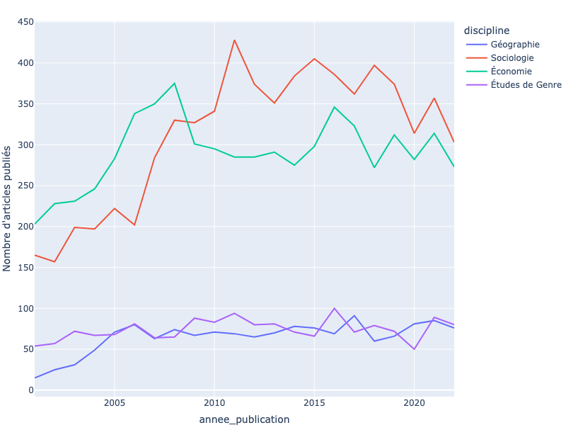
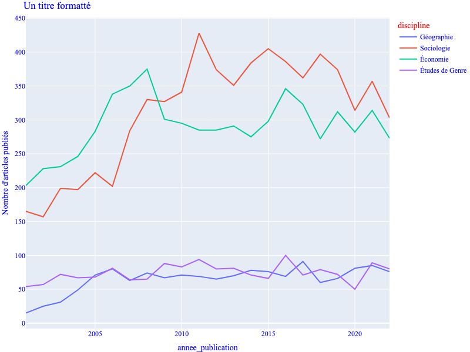

::: {.TODO}
Enlever les **gras** quand c'est pas nécessaire

Vérifier l'espace autour des blocs de code
:::

::: {.NoteAuxEvaluateurices}
Il est possible de se référer aux *datavis* de plusieurs manières différentes (visualisations, figures, représentations et graphes sont les plus courants). Dans le but d'être le plus correct et rigoureux possibles nous avons fait le choix d'écarter le mot 'graphe' qui est trop flou et dont la définition mathématique s'écarte trop de ce que l'on désigne.
Nous avons décidé d'utiliser les mots les situations suivantes :

- "visualisation" : représente l'objet produit donc la représentation graphique dans son entièreté (légende, données, couleurs etc...). Il apparaît (très) souvent.

- "représentation" : se réfère uniquement à la manière de représenter des données. ie on peut proposer plusieurs représentations d'une distribution : représentation en histogramme, en violon, en boîte.

- "figure" : se réfère aux objets Plotly (appelés `fig` dans le code par convention) et dans les captions des images.

Cette définition n'est pas fixe et nous sommes curieux de votre avis sur la question :)
:::
# Introduction
## Objectifs de la leçon
Cette leçon montre comment créer des visualisations de données interactives avec la bibliothèque *open-source* **Plotly**. En particulier, vous apprendrez :
- La différence entre **Plotly Express**, **Plotly Graph Object** et **Plotly Dash**
- Comment créer et exporter des visualisations à l'aide de `plotly.express` et `plotly.graph_objects`
- Comment personnaliser vos visualisations

## Les prérequis
Afin de pouvoir suivre la leçon, il est nécessaire d'avoir :
- installé python 3 et le gestionnaire de paquets (*package*) `pip`
- un niveau de compréhension intermédiaire du language de programmation Python.
- une connaissance générale des bibliothèques `pandas` et `numpy` (ces deux bibliothèques doivent être installées).
- une connaissances de quelques techniques de base de visualisation de données (en particulier les histogrammes, les diagrammes en barres et les nuages de points)
- Des notions de traitement des données (nous utiliserons `pandas`)

## Qu'est ce que Plotly ? 
**Plotly** est une société qui fournit un certain nombre de bibliothèques *open source* permettant aux utilisateurs de construire des visualisations interactives. Celles réalisées avec Plotly se démarquent des images statiques de par leur interactivité, à l'aide de boutons, d'outils pour se déplacer et zoomer, de visualiation en mosaïque et bien plus encore. Les bibliothèques Plotly sont disponibles à la fois en Python - le sujet de cette leçon - ainsi que dans d'autres languages de programmation comme R et Julia. Les librairies de Plotly permettent de réaliser une large variété de visualisations et ce à de nombreuses fins : statistiques, scientifiques, financières ou géographiques. Ces visualisations peuvent être affichées de plusieurs manières : à travers des *notebooks Jupyter*, des pages web (HTML) ou dans des applications web développées avec l'environnement **Dash** de Plotly. Il est aussi possible d'exporter les visualisations sous formes d'images statiques (non interactives) en pixels (*raster*) ou en vectoriel ou vectorielles.

> Tout le long de cette leçon, les visualisations générées à l'aide de Plotly seront affichés comme des images statiques. Pour utiliser les fonctionnalités intéractivesm il faudra cliquer sur l'image ou bien le lien dans la descritption de l'image.

## Plotly, une Librairie Graphique de Python : Plotly Express vs Plotly Graph Objects vs Plotly Dash

Afin de comprendre comment utiliser Plotly, il est fondamental de comprendre les différences entre Plotly Express, Plotly Graph Objects et Plotly Dash.

Il s'agit essentiellement de 3 modules distincts - dont les fonctionnalités peuvent se superposer - qui ont leurs propres objectifs :

- **Plotly Express** (`plotly.express` souvent importé avec l'alias `px`) est une interface de représentation graphique de haut niveau, facile à prendre en main, et qui permet de créer près de 30 différents types de représentations. Le module fournit des fonctions permettant de créer des visualisations avec une seule ligne de code (bien que plusieurs lignes de code sont nécessaires à la personnalisation de certains éléments), rendant les visualisations rapides et faciles à créer. Puisque `plotly.px` est une interface "de haut niveau", cela signifie que l'utilisateur.ice n'a pas besoin de s'attarder sur la structure sous-jacente des visualisations Plotly recommende aux débutant.e.s de commencer avec Express avant de travailler avec Plotly Graph Objects.

- Les objets graphiques de Plotly - associés aux module **Plotly Graph Objects** (`plotly.graph_objects` souvent importé avec l'alias `go`) sont les véritables objets que Plotly créé lorsque l'on fait appel à Plotly Express. Plotly génère des Graph Objects pour garder en mémoire les données de la visualisation. Ces données incluent les informations à visualiser avec de nombreux autres attributs telles que les couleurs, formes et tailles des objets. Il est alors possible de créer une visualisation plus finement en avec Plotly Graph Objects. Il est d'ailleurs possible de recréer n'importe quelle figure créée par Plotly Express à l'aide de Plotly Graph Objects. Il est, en général, recommendé d'utiliser Plotly Express là ou c'est possible pour réduire le nombre de lignes de code. En revanche, comme nous le verrons par la suite, le recours seul à Plotly Express est impossible et il faudra nécessairement passer par Plotly Graph Objects.

- Le module **Plotly Dash** (importé avec l'alias `dash`) est un environnement pour créer des applications web interactives (typiquement des dashboard) qui peuvent être incrustées dans des sites web et autres plateformes. On utilise ajoute souvent des figures créées avec `plotly.px` `plotly.go` dans les applications Dash, faisant des modules de Plotly la boîte à outils parfaite pour créer, manipuler et publier des représentations graphiques interactives de nos données. Plotly Dash est construit sur `React.js` et `Plotly.js` afin de rendre possible l'intégration sur internet, cela signifie que les utilisateur.ice.s n'ont pas besoin de connaissances en Javascript, CSS ou HTML (seulement en Python).

Plotly fournit une documentation complète pour travailler avec **Express** et **Graph Objects** ainsi que pour utiliser **Dash**.

## Pourquoi Plotly ? 

Il existe actuellement une pléthore de librairies graphique disponibles sous python comme **Matplotlib**, **Seaborn**, **Bokeh** ou **Pygal**. Avec autant de possibilités, il est nécessaire de choisir une librairie plutôt qu'une autre. Des critères de choix peuvent être utiles pour décider tels que le cas d'utilisation, les goûts esthétiques ou la facilité d'utilisation avec chaque librairie présentant des avantages. Les avantages principaux de Plotly sont :

- Plotly est l'un des seul package qui est spécifiquement tourné vers les représentations interactive. **Matplotlib** et **Pygal** ne fournissent que très peu de fonctionnalités interactives. **Bokeh** est aussi prévu pour l'interactivité et se place comme une alternatives viable.

- Plotly est la seule suite graphique de python qui assure à la fois une création de visualisations et une intégration dans des pages web simple.

- Plotly intègre parfaitement les objets de pandas (par exemple, on peut directement passer des `pandas.Dataframe` aux objets graphiques de Plotly)

- Des visualisations 3D interactifs sont disponibles (ce qui n'est pas le cas des autres librairies)

- Plotly est simple d'utilisation, les animations et les menus déroulants sont relativement simples à utiliser

# Données utilisées comme exemple
::: {.NoteAuxEvaluateurices}
Les données sont modifiées par rapport à la leçon originale pour s'adapter au contexte francophone.
:::

Le jeu de données utilisé pour cette leçon est issu de l'article "La Part Du Genre. Genre Et Approche Intersectionnelle Dans Les Sciences Sociales Françaises Au Xxie Siècle"[^1]. Celui-ci étudie la part des articles portant sur différentes thématiques, notamment le concept de genre, dans les publications scientifiques de sciences sociales françaises sur les vingts dernières années. Les données de l'enquête ont été rendues publiques dans une démarche de science ouverte, et sont disponibles [ici](https://google.com). La leçon se concentre plus spécifiquement sur la proportion d'auteurs et d'autrices dans les articles et ...

::: {.TODO}
Compléter
:::

[^1]: Ollion, Etienne, Julien Boelaert, Samuel Coavoux, Estelle Delaine, Altaïr Desprès, Sibylle Gollac, Narguesse Keyhani, et al. 2025. “La Part Du Genre. Genre Et Approche Intersectionnelle Dans Les Sciences Sociales Françaises Au Xxie Siècle.” SocArXiv. March 19. doi:10.31235/osf.io/qamux_v1.

# Construire des visualisations avec Plotly Express

## Configurer Plotly Express
1. Avant de commencer, vous aurez besoin d'installer 3 modules à votre environnement
	- Plotly : dans votre terminal, entrez `pip install plotly`
	- pandas : dans votre terminal entrez `pip install pandas`
	- Kaleido : dans votre terminal entre `pip install kaleido`
2. Maintenant que ces packages sont installés, créez un nouveau Jupyter notebook (ou un nouveau fichier python dans votre IDE). Idéalement, placez votre jeu de donnée et votre fichier python / notebook dans le même dossier.
3. Importez les modules à l'aide de la commande `import` au début de votre fichier : 
```{python}
import numpy as numpy
import pandas as pd
import plotly.express as px
```
```{python}
#| eval: true
#| echo: false

# Importing for saving the html files
from images.interactif.save import save_html
```

## Importer et nettoyer les Données

La prochaine étape est d'importer le jeu de donnée et de le nettoyer à l'aide des fonctions de `pandas`. Les étapes à réaliser sont :

- Importer uniquement les colonnes du jeu de donnée qui nous seront utiles

- Remplacer les données numériques qui pourraient manquer par des `np.nan` (objet Numpy *Not a Number*)

- Renommer et retirer certaines données pour plus de claireté et de précision

```{python}
colonnes : list[str] = [
    "annee_publication", "revue", "pourcentage_femme", 
    "inclusif", "genre", "classe", "discipline"
]
df : pd.DataFrame = pd.read_csv("data_article.csv", usecols = colonnes)

# Remplace le code de discipline par son nom
num_discipline : dict = {
    -1 : '<UNK>',           # La discipline est inconnue
    0  : 'Anthropologie',
    1  : 'Aréale',
    2  : 'Autre interdisciplinaire',
    3  : 'Démographie',
    4  : 'Études de Genre',
    5  : 'Géographie',
    6  : 'Histoire',
    7  : 'SIC',
    8  : 'Science politique',
    9  : 'Sociologie',
    10 : 'Économie'
}
df["discipline"] = df["discipline"].replace(num_discipline)

# La colonne "inclusif" contient des chaînes de caractère "true" et "false" 
# et pas des booléens, on doit donc arranger ça.
df["inclusif"] = df["inclusif"].replace({"true" : True, "false" : False})
# Retirer les lignes où la discipline est inconnue
df = df.drop(df[df["discipline"] == "<UNK>"].index)

# Ne conserver que les disciplines désirées
disciplines_desirees = ['Sociologie','Économie','Géographie','Études de Genre']
df = df.drop(df[
    df["discipline"].apply(
        lambda discipline : discipline in disciplines_desirees
    ) == False].index
)

# Création d'une colonne "A majorité féminine" qui indique s'il y avait plus 
# d'autrices que d'auteurs
df["maj_feminine"] = df["pourcentage_femme"] >= 0.5
```

## Diagrammes en barres

Maintenant que nous avons créé un dataframe pandas de notre jeu de donnée, nous pouvons commencer à créer quelques visualisations simples en utilisant **Plotly Express**. Commençons par créer un diagramme en barres pour représenter le nombre d'articles publiés dans chaque discipline. Puisque notre jeu de données ne contient pas le nombre d'article (pour le moment, chaque ligne correspond à un article) nous allons d'abord créer un nouveau `DataFrame` qui regroupera les articles écrits pour chaque discipline puis évaluer le nombre d'entrées dans chaque tableau.
```{python}
# Création d'un nouveau dataframe
articles_par_discipline : pd.Series = df.\
                                groupby(["discipline"], as_index = False).\
                                size()
articles_par_discipline
```

il suffit alors de créer un histogramme en utilisant ce nouveau `DataFrame`. remarquons que cette visualisation est sauvegardé sous la variable `fig`, qui est une convention lorsqu'on travaille avec plotly :
```{python}
#| eval: false
#| echo: true
# Créé le diagramme bâton (bar chart) en utilisant la fonction .bar()
fig = px.bar(articles_par_discipline, x = "discipline", y = "size")

# Affiche la figure en utilisant la fonction .show()
fig.show()
```
```{python}
#| eval: true
#| echo: false

# Cell to properly save and display the graph
fig = px.bar(articles_par_discipline, x = "discipline", y = "size")
fig.update_layout(width = 800,height = 600)
fig.write_image("./images/statique/fig_1.png")
save_html(fig, "./images/interactif/fig_1.html")
```

[](https://google.com)

::: {.TODO}
Link to real https
:::
Vous venez de créer votre première visualisation! Remarquons que cette visualisation est déjà en partie interactive : en passant la souris sur chaque barre, la figure nous spécifie combien d'articles sont représentés et la discipline des articles. Une autre fonctionnalité notable est que l'utilisateur.ice peut sauvegarder la visualisation comme un `.png` (comme image statique) cliquant sur l'icône *appareil photo* qui apparaît lorsque la souris se trouve dans le coin haut droit de l'image. Au même endroit on peut trouver des fonctions de zoom, defilement, changement d'échelle et réinitialiser la vue. Toutes ces fonctionnalités seront disponible pour toutes les visualisations qui suivent.

En revanche, la visualisation n'est pas des plus sympathiques, il manque de couleurs, d'un titre et de titres d'axes plus visibles. Il est possible de préciser ces informations dès le début, en donnant plus d'arguments à la fonction `.bar()`. Par exemple, grâce à l'argument `labels` nous pouvons changer le nom des axes et grâce à l'argument `color` on peut changer la couleur des barres selon une variable de notre jeu de donnée (ici nous utiliserons "Nombres d'articles" pour l'axe vertical). Pour ajouter un titre, il suffit d'utiliser l'argument `title`.
```{python}
#| eval: false
#| echo: true
# Créé un bar chart en utilisant la fonction .bar()
fig = px.bar(
    articles_par_discipline,
    x="discipline",
    y="size",
    title="Titre de votre choix",
    labels={"size": "Nombres d'articles"},

    # Notez que l'argument "color" prend une chaine de caractères se referant à 
    # la colonne "maj_feminine" du jeu de donnée
    color="discipline"
)

fig.show()
```
```{python}
#| eval: true
#| echo: false

# Cell to properly save and display the graph
fig = px.bar(
    articles_par_discipline,
    x="discipline",
    y="size",
    title="Titre de votre choix",
    labels={"size": "Nombres d'articles"},

    # Notez que l'argument "color" prend une chaine de caractères se referant à 
    # la colonne "maj_feminine" du jeu de donnée
    color="discipline"
)
fig.update_layout(width = 800,height = 600)
fig.write_image("./images/statique/fig_2.png")
save_html(fig, "./images/interactif/fig_2.html")
```
[](https://google.com)

::: {.TODO}
Link to real https
:::

Comme montré ci dessus, **Plotly** ajoute automatiquement une légende à la visualisation si vous distinguez les objets par des couleurs (à savoir que la légende peut être retirée). La légende est elle aussi interactive : en cliquant une fois sur un élément, la barre correspondante disparait de la visualisation; en double-cliquant sur un élément, cette fois ci tous les autres objets disparaissent excepté celui que vous avez sélectionné.

## Courbes

Tâchons maintenant de créer une courbe (*line chart*). De manière générale, la syntaxe pour créer une visualisation avec **Plotly Express** est toujours `px.type_de_representation()`  où `type_de_representation` représente le type de représentation que l'on souhaite créer. Comme on a utilisé `px.bar()` pour créer un diagramme en barres (*bar chart*), ici nous utiliserons `px.line()` pour créer un *line chart*. Tous les types de représentations disponibles et les fonctions associées peuvent être trouvées dans la [documentation Plotly](https://perma.cc/U4N7-2VM5).

Notre courbe représentera l'évolution du nombre d'articles par discipline à travers les années. Comme précédemment, nous créons un nouveau `DataFrame` qui regroupera les articles par année, par le critère `discipline`:

```{python}
# Créé un nouveau DataFrame contenant le nombre de d'articles écrits par une majorité de femmes par année
evolution_nbe_articles_par_annee = df.\
    groupby(["discipline", "annee_publication"], as_index=False).\
    size()
```

Ensuite, nous créons plusieurs courbes en utilisant la fonction `.line()` et utilisons les mêmes paramètres que précédement à savoir : `label` et `color`. Ici encore il est possible d'ajouter un titre à notre figure, il suffit de retirer le `#` devait l'argument `title` dans l'exemple suivant (et tous ceux qui suivent) :
```{python}
#| echo: true
#| eval: false
# Créé des courbes avec la fonction px.line() et ajoute quelques customisations
fig = px.line(
    evolution_nbe_articles_par_annee,
    x = "annee_publication",
    y = "size",
    # title = "Ajouter le titre de votre choix",
    labels = {"size" : "Nombre d'articles publiés"},
    color = "discipline"
)

fig.show()
```
```{python}
#| echo: false
#| eval: true
# Créé des courbes avec la fonction px.line() et ajoute quelques customisations
fig = px.line(
    evolution_nbe_articles_par_annee,
    x = "annee_publication",
    y = "size",
    # title = "Ajouter le titre de votre choix",
    labels = {"size" : "Nombre d'articles publiés"},
    color = "discipline"
)

fig.update_layout(width = 800,height = 600)
fig.write_image("./images/statique/fig_3.png")
save_html(fig, "./images/interactif/fig_3.html")
```

[](https://google.com)

::: {.TODO}
Link to real https
:::

Nous avons appris à créer de nouvelles visualisations et de les personnaliser - mais comment faire pour personnaliser notre figure après l'avoir créer ? À la place nous pouvons utiliser la fonction `.update_layout()` sur notre `fig` pour éditer après coup. Cette fonction peut être appliquée à n'importe quelle figure générée avec **Plotly Express** afin de modifier un large panel de paramètres. Prenons comme exemple la fonction générée précédemment et modifions la police, la couleur et la taille de notre titre : 

```{python}
#| echo: true
#| eval: false
fig.update_layout(
    font_family = "Courrier New",   # Modification de la police
    font_color = "blue",            # Modification de la couleur du texte
    legend_title_font_color = "red",# Modification de la couleur du titre de la légende
    title = "Un titre formatté"
)

fig.show()
```
```{python}
#| echo: false
#| eval: true
fig.update_layout(
    font_family = "Courrier New",   # Modification de la police
    font_color = "blue",            # Modification de la couleur du texte
    legend_title_font_color = "red",# Modification de la couleur du titre de la légende
    title = "Un titre formatté"
)

fig.update_layout(width = 800,height = 600)
fig.write_image("./images/statique/fig_4.png")
save_html(fig, "./images/interactif/fig_4.html")
```
[](https://google.com)

::: {.TODO}
Link to real https
:::

## Nuages de points

Les nuages de points (*scatterplots*), généralement utilisés pour visualiser des relations entre 2 variables continues, peuvent être générés à l'aide de **Plotly Express** en utilisant la fonction `scatter()`. Pour notre jeu de donnée, il peut être intéressant d'utiliser un nuage de points pour montrer la relation entre la proportion d'articles  de revue qui parlent de genre et la proportion d'articles de la revue qui mentionnent la classe par discipline. 

Il nous faut créer un nouveau `DataFrame` : 
```{python}
proportion_genre_classe = df.groupby(["revue","discipline"], as_index=False)[["genre","classe"]].\
    agg(
        proportion_genre = ("genre", lambda x : 100 * x.mean()),
        proportion_classe = ("classe", lambda x : 100 * x.mean()),
    )
```

```{python}
#| echo: true
#| eval: false
fig = px.scatter(
    proportion_genre_classe,
    x="proportion_classe",
    y="proportion_genre",
    color="discipline", 
    # title="Titre de votre choix",
)
fig.show()
```
```{python}
#| echo: false
#| eval: true
fig = px.scatter(
    proportion_genre_classe,
    x="proportion_classe",
    y="proportion_genre",
    color="discipline", 
    # title="Titre de votre choix",
)

fig.update_layout(width = 800,height = 600)
fig.write_image("./images/statique/fig_5.png")
save_html(fig, "./images/interactif/fig_5.html")
```
[](https://google.com)

::: {.TODO}
Link to real https
:::

Comme vous pouvez le voir, les nuages de points contiennent aussi certaines intéractions par défaut : survoler les points permet d'afficher les données spécifique de proportions d'articles mentionnant le genre ou la classe. Cliquer ou double cliquer sur le nom des disciplines dans la légende permet d'isoler certains éléments.

# Créer une visualisation en mosaïque

Pour créer une visualisation en mosaïque (*facet plots*) qui partagent certains axes et permettent de montrer des sous ensembles de notre jeu de donnée. Plotly rend la création de telles visualisations très simple. En reprenant les exemples précédents, il suffit de spécifier le type de représentation que vous souhaitez dans les sous-figures. En deuxième instance il suffit d'utiliser le paramètre `facet_col` qui permet de préciser quel variable utiliser pour distinguer les sous-figures. Dans l'exemple ci dessous, on créé une grille de 2x1 pour montrer la part d'articles qui mentionnent le genre en fonction de la discipline et si cela a été écrit par une majorité de femmes ou une majorité d'hommes :
```{python}
#| eval: false
#| echo: true
proportion_par_discipline_maj_feminine = df.\
    groupby(["maj_feminine","discipline"], as_index=False)[["genre"]].\
    agg(proportion_genre = ("genre", lambda x : 100 * x.mean()))

# Use px.bar() to indicate that we want to create bar charts
fig = px.bar(
    proportion_par_discipline_maj_feminine,
    x="discipline",
    y="proportion_genre",
    facet_col="maj_feminine",  # Use facet_col parameter to specify which field to split graph by
    color="discipline",
    # title="Add a title here",
)
fig.show()
```
```{python}
#| eval: true
#| echo: false
proportion_par_discipline_maj_feminine = df.\
    groupby(["maj_feminine","discipline"], as_index=False)[["genre"]].\
    agg(proportion_genre = ("genre", lambda x : 100 * x.mean()))

# Use px.bar() to indicate that we want to create bar charts
fig = px.bar(
    proportion_par_discipline_maj_feminine,
    x="discipline",
    y="proportion_genre",
    facet_col="maj_feminine",  # Use facet_col parameter to specify which field to split graph by
    color="discipline",
    # title="Add a title here",
)

fig.update_layout(width = 800,height = 600)
fig.write_image("./images/statique/fig_6.png")
save_html(fig, "./images/interactif/fig_6.html")
```

[](https://google.com)

::: {.TODO}
Link to real https
:::

Notez que cette méthode ne nécessite pas de spécifier les dimensions de la grille puisque **Plotly Express** divise automatiquement la figure par le nombre de catégories disponibles (ici 2 puisque les 2 catégories disponibles sont majorité masculine / féminine). Cependant cette méthode ne peut fonctionner uniquement pour des figures ne représentant qu'un seul type de représentation (ici diagrammes en barres). Nous discutons plus bas de la manière des figures contenant des sous figures de dimensions particlulières en utilisant **Graph Objects**.

## Ajouter des animations : évolution temporelle

Comme nous l'avons vu, **Plotly Express** contient des fonctionnalités intéractives native. Et pourtant, il y a encore de nombreuses fonctionnalités qui peuvent être implémentées pour augmenter l'intéractivité comme les animations à travers les *animation frames*.

Une *animation frame* représente la manière dont les données changent en fonction d'un certain axe. Dans les recherches historiques, la mesure la plus utile est l'axe temporel bien que d'autres variables numérique avec une relation d'ordre (ex : les entiers, ou un intervalle comme $[0,1]$) peut fonctionner. Une figure **Plotly Express** avec une animation contient une barre de défilement intéractive permettant de jouer/arrêter l'animation mais aussi de se déplacer manuellement dans les données.

Pour créer une visualisation avec une animation, il faut commencer par sélectionner le type de représentation que nous voulons utiliser comme dans les exemples précédents. Puis, à l'intérieur de la fonction on utilise le paramètre `animation_frame` pour spécifier quel variable doit petre utilisée pour visualiser l'évolution. Dans notre exemple, nous reprenons le nombre d'articles mentionnant le genre et affichons l'évolution à travers les années

```{python}
#| echo: true
#| eval: false
proportion_genre_animation = df.groupby(["annee_publication","discipline"],
                                as_index = False).size()
# On utilise px.bar pour créer un diagramme bâton
fig = px.bar(
    proportion_genre_animation,
    x="discipline",
    y="size",
    labels={"size": "Nombre d'articles mentionnant le genre publiés"},
    range_y=[0,500],  # Le paramètre range_y permet de customiser l'intervalede l'axe y
    color="discipline",
    # title="Add a title here",
    animation_frame="annee_publication", # Use animation_frame to specify which variable to measure for change
)
fig.show()
```
```{python}
#| echo: false
#| eval: true
proportion_genre_animation = df.groupby(["annee_publication","discipline"],
                                as_index = False).size()
# On utilise px.bar pour créer un diagramme bâton
fig = px.bar(
    proportion_genre_animation,
    x="discipline",
    y="size",
    labels={"size": "Nombre d'articles mentionnant le genre publiés"},
    range_y=[0,500],  # Le paramètre range_y permet de customiser l'intervalede l'axe y
    color="discipline",
    # title="Add a title here",
    animation_frame="annee_publication", # Use animation_frame to specify which variable to measure for change
)
fig.update_layout(width = 800,height = 600)
fig.write_image("./images/statique/fig_7.png")
save_html(fig, "./images/interactif/fig_7.html")
```

[](https://google.com)

::: {.TODO}
Link to real https
:::

## Ajouter des animations : Menus déroulants

Les menus déroulants sont légèrements plus difficiles que les *animation frames*. Ils permettent à l'utilisateur.ice de passer d'une configuration d'affichage à une autre comprenant une large variété de paramètres permettant de changer les couleurs, lignes, axes et mêmes les variables. Quand on créé une figure avec un menu déroulant, la première étape est de créer la figure initiale *sans menu déroulant* (qui correspondra à la première vue que l'utilisateur.ice verra). Dans cet exemple, nous travaillerons avec le nuage de points qui illustre la parts des articles mentionnant la classe et le genre. La construction est donc la suivante : 
```{python}
fig = px.scatter(
    proportion_genre_classe,
    x="proportion_classe",
    y="proportion_genre",
    color="discipline", 
    # title="Titre de votre choix",
    # labels = {}
)
```

Notons que la figure a été céée mais n'est pas visible puisque nous n'avons pas encore utilisé la fonction `fig.show()`. La figure sera affichée une fois que nous avons ajouté le menu dérorulant dans les prochaines étapes.

Après avoir créé la vue initiale, nous pouvons utilisé la fonction `update_layout` à nouveau pour ajouter un menu déroulant.\\
C'est l'étape la plus complexe puisque les données de l'objet **Plotly Express** sont imbriquées à plusieurs niveau *sous le capot*, donc nous avons besoin de modifier des attributs à un niveau plus profond qu'à l'habitude pour créer le menu.\\

Une fois qu'on a appelé la fonction `update_layout`:

- nous devons d'abord accéder le paramètre `updatemenus`: c'est une liste de dictionnaires, chaque dictionnaire contient les métadonnées pour plusieurs fonctionnalités.

- la seule fonctionnalité qui nous intéresse est le `dropdown box`, qui est contenue dans le dictionnaire `buttons`.

- la clef `boutton` contient comme valeur, une autre liste de dictionnaires, chaque dictionnaire représente les options disponibles dans le menu déroulant.

- Nous aurons besoin de créer 5 `buttons` — one pour chaque sous-groupe de données — donc notre list `buttons` contiendra 5 dictionnaires.

::: {.NoteAuxEvaluateurices}
 the original article is inconsistant
:::

- chacun de ces deux dictionnaires devront contenir 3 paires clef-valeur :

    - la première paire, avec pour clef `args` précisera le type de représentation que nous voulons afficher.

    - la deuxième paire, avec pour clef `label` précisera le titre à afficher à côté du menu déroulant.

    - la troisième paire, avec pour clef `method`, précisera comment modifier la figure (modifications possibles `update`, `restyle`, `animer`, etc...)

Dans l'exemple ci dessous, nous regarderons comment utiliser le menu déroulant pour changer la catégorie de la variable affichée. Puisque nous travaillons avec un nuage de points qui affiche la part des journaux qui parlent de genre et de classe, nous ajouterons un menu déroulant qui permet d'afficher toutes les disciplines ensembles, puis seulement les journaux de sociologie, seulement les journaux de géographie.\\
Pour créer le menu déroulant nous suivant les étapes suivantes :
 - à la clef `label` nous associons pour valeur, le texte à afficher dans le menu déroulant.
 - à la clef `method`, nous associons la valeur `update` puisque nous modifions l'affichange (`layout`) ET les données (`data`).
 - à la clef `args`, nous associons une autre liste de dictionnaires qui spécifiera quelle données seront `visible`(s) (vous trouverez plus d'informations à ce propos plus bas), le titre de la vue (paramètre optionnel), ainsi que les titres pour les axes x et y de cette vue (paramètre optionnel).

Le paramètre `visible` contient une liste, chaque élément de cette liste indiquera si les données à cet index doit être affiché où non. Dans notre exemple, la liste doit contenir 4 éléments puisque nous avons 4 catégories à l'écran. Dans notre cas, le premier boutton doit représenter la visualisation telle qu'elle sera initiallement présentée à l'utilisateur.ice et doit donc spécifier `[True, True, True, True]` puisque nous souhaitons que toutes les disciplines soient affichées. Cependant, pour les 3 autres vues, nous devons seulement inscrire `True` pour un seul élément puisaue ous souhaitons n'afficher qu'une discipline à la fois.

Passons à la pratique :
```{python}
#| echo: true
#| eval: false
# Nous utilisons la fonction .update_layout pour ajouter le menu déroulant
fig.update_layout(
    updatemenus = [dict(
        buttons = [
            # Création de la liste de boutson pour stocker un dictionnaire pour chaque option du menu déroulant.
            dict(
                label = "Toutes les disciplines", # Nom pour ma première vue
                method = "update",
                args = [
                    # Cette vue montre les 4 disciplines
                    {"visible" : [True, True, True, True]},
                    {
                        "title" : "Toutes les disciplines",
                        "xaxis" : {"title" : "Part des articles mentionnant la classe"},
                        "yaxis" : {"title" : "Part des articles mentionnant le genre"}
                    }
                ]
            ),
            dict(
                label = "Géographie", # Nom pour ma deuxième vue
                method = "update",
                args = [
                    # Cette vue montre les seulement la première discipline
                    {"visible" : [True, False, False, False]}, 
                    {
                        "title" : "Géographie",
                        "xaxis" : {"title" : "Part des articles mentionnant la classe"},
                        "yaxis" : {"title" : "Part des articles mentionnant le genre"}
                    }
                ]
            ),
            dict(
                label = "Sociologie", # Nom pour ma troisième vue
                method = "update",
                args = [
                    # Cette vue montre uniquement la deuxième discipline
                    {"visible" : [False, True, False, False]}, 
                    {
                        "title" : "Sociologie",
                        "xaxis" : {"title" : "Part des articles mentionnant la classe"},
                        "yaxis" : {"title" : "Part des articles mentionnant le genre"}
                    }
                ]
            ),
            dict(
                label = "Économie", # Nom pour ma quatrième vue
                method = "update",
                args = [
                    # Cette vue montre la 3è discipline
                    {"visible" : [False, False, True, False]},
                    {
                        "title" : "Économie",
                        "xaxis" : {"title" : "Part des articles mentionnant la classe"},
                        "yaxis" : {"title" : "Part des articles mentionnant le genre"}
                    }
                ]
            ),
            dict(
                label = "Études de Genre", # Nom pour ma cinquième vue
                method = "update",
                args = [
                    # Cette vue montre la 4è discipline
                    {"visible" : [False, False, False, True]},
                    {
                        "title" : "Études de Genre",
                        "xaxis" : {"title" : "Part des articles mentionnant la classe"},
                        "yaxis" : {"title" : "Part des articles mentionnant le genre"}
                    }
                ]
            ),
        ]
    )]
)

fig.show()
```
```{python}
#| echo: false
#| eval: true
# Nous utilisons la fonction .update_layout pour ajouter le menu déroulant
fig.update_layout(
    updatemenus = [dict(
        buttons = [
            # Création de la liste de boutson pour stocker un dictionnaire pour chaque option du menu déroulant.
            dict(
                label = "Toutes les disciplines", # Nom pour ma première vue
                method = "update",
                args = [
                    # Cette vue montre les 4 disciplines
                    {"visible" : [True, True, True, True]},
                    {
                        "title" : "Toutes les disciplines",
                        "xaxis" : {"title" : "Part des articles mentionnant la classe"},
                        "yaxis" : {"title" : "Part des articles mentionnant le genre"}
                    }
                ]
            ),
            dict(
                label = "Géographie", # Nom pour ma deuxième vue
                method = "update",
                args = [
                    # Cette vue montre les seulement la première discipline
                    {"visible" : [True, False, False, False]}, 
                    {
                        "title" : "Géographie",
                        "xaxis" : {"title" : "Part des articles mentionnant la classe"},
                        "yaxis" : {"title" : "Part des articles mentionnant le genre"}
                    }
                ]
            ),
            dict(
                label = "Sociologie", # Nom pour ma troisième vue
                method = "update",
                args = [
                    # Cette vue montre uniquement la deuxième discipline
                    {"visible" : [False, True, False, False]}, 
                    {
                        "title" : "Sociologie",
                        "xaxis" : {"title" : "Part des articles mentionnant la classe"},
                        "yaxis" : {"title" : "Part des articles mentionnant le genre"}
                    }
                ]
            ),
            dict(
                label = "Économie", # Nom pour ma quatrième vue
                method = "update",
                args = [
                    # Cette vue montre la 3è discipline
                    {"visible" : [False, False, True, False]},
                    {
                        "title" : "Économie",
                        "xaxis" : {"title" : "Part des articles mentionnant la classe"},
                        "yaxis" : {"title" : "Part des articles mentionnant le genre"}
                    }
                ]
            ),
            dict(
                label = "Études de Genre", # Nom pour ma cinquième vue
                method = "update",
                args = [
                    # Cette vue montre la 4è discipline
                    {"visible" : [False, False, False, True]},
                    {
                        "title" : "Études de Genre",
                        "xaxis" : {"title" : "Part des articles mentionnant la classe"},
                        "yaxis" : {"title" : "Part des articles mentionnant le genre"}
                    }
                ]
            ),
        ]
    )]
)

fig.update_layout(width = 1000,height = 600)
fig.write_image("./images/statique/fig_8.png")
save_html(fig, "./images/interactif/fig_8.html")
```

[](https://google.com)

::: {.TODO}
Link to real https
:::

Créer ce menu déroulant dans l'exemple ci dessus permet aux utilisateur.ice.s d'isoler (et examiner) des éléments spécifiques à partir d'une visualisation plus générale. Nous avions découvert cette fonctionnalité de **Plotly** plus tôt en notant qu'un double clique sur une catégorie de la légende permettait de retirer tous les autres groupes de la figure. Cependant, le menu déroulant apporte d'autres avantages : il nous permet de créer des titres dynamiques qui peuvent changer en fonction de ce que nous avons selectionné.\\

L'exemple ci-dessus montre qu'il est très facile de créer des visualisations avec **Plotly Express** et qu'il est relativement simple de rajouter de l'interactivité comme des animations ou des menus déroulants. Nous allons maintenant passer à la création de graphes avec **Plotly Graph Objects**. Plus précisément, nous allons nous concentrer sur ce que sont les **Graph Objects**, comment ils fonctionnent et quand (ou pourquoi) vous pourriez avoir envie de créer des graphes en utilisant **Plotly Graph Objects** plutôt qu'avec **Plotly Express**.

# Création des graphes avec `Plotly Graph Objects`

## Configuration de `Plotly Graph Objects`

Pour commencer à travailler avec `Plotly Graph Objects`, vous aurez besoin d'importer le module `graph_objects` :
```{python}
import plotly.graph_objects as go 
from plotly.graph_objs.scatter.marker import Line # Pas nécessaire mais évite de déclencher 'DeprecationWarning'.
```

> **Notons que dans un script `.py` conventionnel, les librairies devraient être importées au début du script. On importe ici les librairies pour un soucis de claireté.**

::: {.NoteAuxEvaluateurices}
Le constructeur `Line` n'est plus tellement utilisé. On aurait tendance à utiliser `go.Scatter(..., mode="markers+lines")`. C'est ce que j'ai fait pour la suite du tutoriel dans une volonté de mettre à jour les informations
:::

## Ce ne sont que des Objets ! La structure des données de `Plotly Graph Objects` 

Comme mentionné en introduction de cette leçon, toutes les figures créées avec `Plotly Express` sont en fait des `Graph Objects` sous le capot. Cela signifie que, lorsque nous créons une figure avec `plotly.px`, vous êtes en fait en train de créer une instance de `Graph Object`.

Cela devient évident si l'on utilise la fonction `type` avec la variable `fig` :
```{python}
# Résultat du type de la figure
print(type(fig))
``` 

Il est alors important de toujours garder en tête que les figures créées avec `Plotly` sont des `Graph Objects`.

Les `Graph Objects` sont représentés comme des structres de données en arbre (ie. hiérarchiques) avec trois racines :

- la racine `data` — *données* — contient des infotmations comme le type de représentation, les catégories disponibles, les points associés à chaque catégorie, l'option d'affichage dans la légende, le type de marqueurs utilisés, les informations à afficher lorsque l'on survole les points.

- la racine `layout` — *affichage* — contient des informations telles que les dimensions de la figure, les polices et couleurs d'écriture à utiliser, les annotations, les coordinnées des sous-figures (*subplots*), et si des images doivent être utilisées comme arrière plan.

- la racine `frames` contient toutes les informations reliées aux animations utilisées dans la figure, comme les données à afficher à chaque *frame*. Cet attribut ne sera pas créé si vous n'ajoutez pas d'animation à la figure.

Il est facile de voir la structure de données sous-jacente d'une figure en l'imprimant comme un dictionnaire avec la fonction `fig.to_dict()`. Pour lire ces données plus facilement, on peut utiliser le format `JSON` avec la fonction `fig.to_json(pretty = True)`. Dans l'exemple ci dessous, nous ne montrons que les 500 premiers caractères comme extrait de sortie après utilisation de cette fonction (une fois encore, en utilisant la variable `fig` créée précédemment).

```{python}
# print(fig.to_dict())
print(fig.to_json(pretty = True)[0:500] + "\n...")
```

Examiner la sortie affichée devrait pouvoir vous aider à comprendre la structure de données sous-jacente et les propriétés d'un `Graph Object`. Si vous imprimez la sortie entière (en utilisant `fig.to_dict()`) vous noterez que : 

- la structure de donnée contient des `data` pour chaque discipline (Géographie, Économie, Sociolgie et Études de genre) chaque discipline dispose de son propre dictionnaire.

- l'attribut `data` qualifie quel type de graphe est utilisé (ici `Scatter`)

- l'attribut `layout` contient le titre de la figure

- l'attribut `layout` contient les données associées aux `buttons` (ie le menu déroulant).


- Il n'y a pas d'attribut `frames` puisqu'il n'y a pas d'animation associées à la figure.

::: {.NoteAuxEvaluateurices}
Erreur dans l'article origninal
:::

## Utiliser `Plotly Graph Objects` **vs** `Plotly Express`

Un autre point qu'il est important d'avoir à l'esprit c'est que créer des graphes avec `plotly.go` requiert, en général, bien plus de code qu'en créant un graphe identique avec `plotly.px`.

Voyez plutôt l'exemple suivant : construisons un diagramme bâton horizontal pour montrer le nombre d'articles mentionnant le genre par catégorie. Premièrement, créons un DataFrame qui compte le nombre d'articles mentionnant le genre par discipline :

```{python}
articles_par_discipline_mention_genre : pd.Series = df.\
    groupby(["discipline"], as_index = False).\
    size()
```

Construisons maintenant le diagramme en barres horizontal avec ces données, grâce à `plotly.go` :
```{python}
#| echo: true
#| eval: false

fig = go.Figure(
    go.Bar(
        x = articles_par_discipline_mention_genre["size"], # On utilise go.Bar() pour spécifier le type de chart à utiliser
        y = articles_par_discipline_mention_genre["discipline"],
        orientation = "h",
        hovertemplate = "Discipline : %{y}<br>Nombre d'articles : %{x}<extra></extra>"  # Nous devons formatter le "hover text" alors que c'est automatique avec plotly.px
    ),
    # layout = {"title" : "Ajouter le titre de votre choix"},
)

fig.update_layout(
    # Il est nécessaire d'utiliser la fonction update_layout pour ajouter des titres d'axes alors que c'est automatique avec plotly.px
    xaxis = {"title" : "Nombre d'articles"},
    yaxis = {"title" : "Discipline"}
)

fig.show()
```
```{python}
#| echo: false
#| eval: true

fig = go.Figure(
    go.Bar(
        x = articles_par_discipline_mention_genre["size"], # On utilise go.Bar() pour spécifier le type de chart à utiliser
        y = articles_par_discipline_mention_genre["discipline"],
        orientation = "h",
        hovertemplate = "Discipline : %{y}<br>Nombre d'articles : %{x}<extra></extra>"  # Nous devons formatter le "hover text" alors que c'est automatique avec plotly.px
    ),
    # layout = {"title" : "Ajouter le titre de votre choix"},
)

fig.update_layout(
    # Il est nécessaire d'utiliser la fonction update_layout pour ajouter des titres d'axes alors que c'est automatique avec plotly.px
    xaxis = {"title" : "Nombre d'articles"},
    yaxis = {"title" : "Discipline"}
)

fig.update_layout(width = 800,height = 600)
fig.write_image("./images/statique/fig_9.png")
save_html(fig, "./images/interactif/fig_9.html")
```

[](https://google.com)

::: {.TODO}
Link to real https
:::

Notons que lorsque l'on utilise `Plotly Object Graphs`, on peut fournir un titre en utilisant l'argument `layout`, qui prend un dictionnaire contenant la clef `title` et sa valeur.

Mainteant créons le même graphe avec `plotly.px` :

```{python}
#| echo: true
#| eval: false

fig = px.bar(
    articles_par_discipline_mention_genre,
    x = "size", y = "discipline",
    orientation = "h",
    #title = "Titre de votre choix",
    labels = {"size" : "Nombre d'articles"}
)
fig.show()
```
```{python}
#| echo: false
#| eval: true

fig = px.bar(
    articles_par_discipline_mention_genre,
    x = "size", y = "discipline",
    orientation = "h",
    #title = "Titre de votre choix",
    labels = {"size" : "Nombre d'articles"}
)

fig.update_layout(width = 800,height = 600)
fig.write_image("./images/statique/fig_10.png")
save_html(fig, "./images/interactif/fig_10.html")
```

[](https://google.com)

::: {.TODO}
Link to real https
:::

Il est clair d'après les exemples précédents que `plotly.go` recquiert plus de code que `plotly.px` car de nombreuses fonctionnalités nécessitent d'être manuellement créées dans `plotly.go`. Ainsi, il est en général recommendé d'utiliser `plotly.px` quand c'est possible.

## Pourquoi utiliser `Graph Objects`

Ceci devrait nous amener à la question centrale : si c'est si simple d'utiliser `plotly.px` pour créer des visualisations, pourquoi devrions nous nous embêter avec `plotly.go`? La réponse simple est qu'il y a en réalité de nombreuses fonctionalités utiles qui ne sont accessibles qu'à travers `plotly.go`. Nous jettons un oeil à deux de ces fonctionalités dans cette section du tutoriel : les tableaux et les compositions de figures (*subplots*).

### Tableaux

L'une des fonctionnalités de `plotly.go` la plus utile, est l'option de créer des tableaux intéractifs et propres.

Pour cela, suivont les 4 étapes suivantes :

1. Créer une figure avec la fonction `.Figure()`

2. à la racine `data`, utiliser la fonction `.Table()` pour spécifier que la figure doit être une table.

3. Dans la fonction `.Table()`, créer un dictionnaire entête (`header`) pour stocker la list des colonnes de l'entête

4. Dans la fonction `.Table()`, ajouter un dictionnaire cellules (`cells`) pour y mettre les valeurs du tableau

Il est aussi possible de customiser grâce à des labels, couleurs, et des options d'alignement

Dans l'exemple ci dessous, nous créons un tableau pour stocker l'entièreté de la base de donnée de l'article.

```{python}
fig = go.Figure(
    data = [
        go.Table(
            header = {
                "values" : df.columns,
                "fill_color" : "paleturquoise",
                "align" : "left"
            },
            cells = {
                "values" : df.transpose().values.tolist(),
                "fill_color" : "lavender",
                "align" : "left"
            }
        )
    ]
)

fig.show()
```
```{python}
fig = go.Figure(
    data = [
        go.Table(
            header = {
                "values" : df.columns,
                "fill_color" : "paleturquoise",
                "align" : "left"
            },
            cells = {
                "values" : df.transpose().values.tolist(),
                "fill_color" : "lavender",
                "align" : "left"
            }
        )
    ]
)

fig.update_layout(width = 800,height = 600)
fig.write_image("./images/statique/fig_11.png")
save_html(fig, "./images/interactif/fig_11.html")
```

[](https://google.com)

::: {.TODO}
Link to real https
:::

De la même manière qu'avec `plotly.px`, les figures de `plotly.go` permettent une certaine intéractivté native. Les tableaux par exemple permettent aux utilisateur.ices de faire défiler les lignes du tableau (en utilisant le trackpad ou la bar de défilement sur la droite). Ces objets sont ainsi excellents pour économiser de la place. Il est aussi facile de déplacer des colonnes en cliquant sur l'entête d'une colonne et la déplaçant à droite ou à gauche. 

### La compositions de figures (*subplots*)

Une autre fonctionnalité très utile de `plotly.go` est le fait de pouvoir créer des compositions de figures. Bien que `plotly.px` permette de créer des visualisations en mosaïque, le champ des possibles est relativement limité puisque les sous-figures générées doivent toutes partager le même type de représentation, les axes et les variables à afficher. La composition de figures permet elle de créer des grilles contenant différents types de représentations avec leurs axes et variables propres afin de transformer les figures en des objets proches des *dashboard*.

Puisque le code est particulièrement long pour créer des compositions de figures, cet exemple sera présenté pas à pas. Nous créérons une grille de 3x1 contenant 3 différents graphes : le premier sera un diagramme en barres standard pour quantifier le nombre d'articles mentionnant le genre à travers les disciplines; le deuxième sera une courbe affichant l'évolution de la part des articles mentionnaient le genre à travers les années. Enfin le dernier graphe sera un diagramme en boîte (avec la représentation du minimum, maximum, interquartile d'une distribution) sur la distribution de la part d'auteurices dans les articles en fonction de si l'article est écrit en écriture inclusive ou non.
#### Étape 1 : importer le module subplots et préparer les données

```{python}
# Importer make_subplots
from plotly.subplots import make_subplots

# Préparation des données
articles_par_discipline_mention_genre = df.\
    loc[df["genre"] == 1, :].\
    groupby("discipline", as_index = False).\
    size()

proportion_d_articles_mentionnant_le_genre_par_annee = df.\
    loc[:,["discipline", "annee_publication", "genre"]].\
    groupby(["discipline", "annee_publication"], as_index = False).\
    mean()

pourcentage_d_auteurice_femme_si_inclusif = df.\
    groupby("genre")
```

#### Étape 2 : Création d'une composition de sousfigures vide avec une grille 3x1 grâce à la fonction `make_subplots`

```{python}
# 1 ligne, 3 colonnes
fig = make_subplots(rows = 1, cols = 3)
```

#### Étape 3 création du premier graphe (le diagramme bâton) grace à la fonction `.add_trace()`

```{python}
#| echo: true
#| eval: false

fig.add_trace(
    # la fonction go.Bar permet de spécifier le type de graphe à créer
    go.Bar(
        x = articles_par_discipline_mention_genre["size"],
        y = articles_par_discipline_mention_genre["discipline"],
        orientation = "h",
        name = "Nombre d'articles publiés mentionnant le genre par discipline",
        hovertemplate = "<b>Discipline :</b> %{y}<br><b>Nombre d'articles publiés</b> : %{x}<extra></extra>"
    ),
    row = 1, col = 1 # Les paramètres row et col permettent de positionner le graphe dans la bonne case
)
```
```{python}
#| echo: false
#| eval: true

fig.add_trace(
    # la fonction go.Bar permet de spécifier le type de graphe à créer
    go.Bar(
        x = articles_par_discipline_mention_genre["size"],
        y = articles_par_discipline_mention_genre["discipline"],
        orientation = "h",
        name = "Nombre d'articles publiés mentionnant le genre par discipline",
        hovertemplate = "<b>Discipline :</b> %{y}<br><b>Nombre d'articles publiés</b> : %{x}<extra></extra>"
    ),
    row = 1, col = 1 # Les paramètres row et col permettent de positionner le graphe dans la bonne case
)

fig.update_layout(width = 1200,height = 400)
fig.write_image("./images/statique/fig_12.png")
save_html(fig, "./images/interactif/fig_12.html")
```

[](https://google.com)

::: {.TODO}
Link to real https
:::

> **Nota : si vous créez une composition de figure dans un Notebook Jupyter, relancer le code pourrait dupliquer la trace que vous venez d'ajouter et donc doubler la légende. Si vous avez besoin de relancer le code, il vaudrait mieux redémarrer le kernel d'abord.**

:::{.NoteAuxEvaluateurices}
En vrai c'est pas nécessaire, il suffit de relancer la cellule où on définit la variable `fig`. Est ce qu'on veut corriger ? 
:::

> **Nota : si vous créez une composition de figure dans un Notebook Jupyter, relancer le code pourrait dupliquer la trace que vous venez d'ajouter et donc doubler la légende. Si vous avez besoin de relancer le code, il vaudrait mieux relancer à partir de la cellule qui définit la variable `fig` que vous modifiez.**

#### Étape 4 : Ajouter le second graphe (courbe)

```{python}
#| echo: true
#| eval: False

# Pour chaque discipline il faut créer un objet go.Line différent afin de créer les différentes courbes. 
# Pour se faire, on divise notre dataframe par discipline et on procède comme précédemment en ne travaillant qu'avec les sous-dataset
for discipline, df_discipline in proportion_d_articles_mentionnant_le_genre_par_annee.groupby("discipline") :
    fig.add_trace(
        # la fonction go.Scatter permet de spécifier le type de graphe à créer
        go.Scatter(
            x = df_discipline["annee_publication"],
            y = df_discipline["genre"],
            name = discipline,
            mode = "markers+lines",
            hovertemplate = (f"<b>Discipline :</b> {discipline}"
                             "<br><b>Année :</b> %{x}<br><b>Propotion des particles :</b> %{y}")  

        ),
        
        row = 1, col = 2 # Les paramètres row et col permettent de positionner le graphe dans la bonne case
    )
```

```{python}
#| echo: false
#| eval: true

# Pour chaque discipline il faut créer un objet go.Line différent afin de créer les différentes courbes. 
# Pour se faire, on divise notre dataframe par discipline et on procède comme précédemment en ne travaillant qu'avec les sous-dataset
for discipline, df_discipline in proportion_d_articles_mentionnant_le_genre_par_annee.groupby("discipline") :
    fig.add_trace(
        # la fonction go.Scatter permet de spécifier le type de graphe à créer
        go.Scatter(
            x = df_discipline["annee_publication"],
            y = df_discipline["genre"],
            name = discipline,
            mode = "markers+lines",
            hovertemplate = (f"<b>Discipline :</b> {discipline}"
                             "<br><b>Année :</b> %{x}<br><b>Propotion des particles :</b> %{y}")  

        ),
        
        row = 1, col = 2 # Les paramètres row et col permettent de positionner le graphe dans la bonne case
    )

fig.update_layout(width = 1200,height = 400)
fig.write_image("./images/statique/fig_13.png")
save_html(fig, "./images/interactif/fig_13.html")
```

[](https://google.com)

::: {.TODO}
Link to real https
:::

#### Étape 5 : Ajouter le dernier graphe (diagramme en boîte)

Nous n'avons pas encore exploré les diagrammes en boîte (*boxplot*), mais ils sont créés de la même manière que les autres graphes et ont une intéractivité native similaire (survoler une boîte nous montrera la valeur minimum, maximum, médiane, et les interquartiles des données affichées).

```{python}
#| echo: true
#| eval: false

fig.add_trace(
    # On utilise la fonction go.Box() pour spécifier qu'on créé un graphe de boîtes à moustache
    go.Box(
        y = pourcentage_d_auteurice_femme_si_inclusif.\
            get_group(True)["pourcentage_femme"],
        name = "Genre"),
        row = 1, col = 3 # puisque c'est le 3è graphe, on le met sur la 3è colonne
)

# On ajoute la deuxième boîte à moustage puisqu'on a 2 groupes distincts pour les articles avec et sans écriture inclusive
fig.add_trace(
    go.Box(
        y = pourcentage_d_auteurice_femme_si_inclusif.\
            get_group(False)["pourcentage_femme"],
        name = "Pas genre"),
    row = 1, col = 3 
)
```

```{python}
#| echo: false
#| eval: true

fig.add_trace(
    # On utilise la fonction go.Box() pour spécifier qu'on créé un graphe de boîtes à moustache
    go.Box(
        y = pourcentage_d_auteurice_femme_si_inclusif.\
            get_group(True)["pourcentage_femme"],
        name = "Genre"),
        row = 1, col = 3 # puisque c'est le 3è graphe, on le met sur la 3è colonne
)

# On ajoute la deuxième boîte à moustage puisqu'on a 2 groupes distincts pour les articles avec et sans écriture inclusive
fig.add_trace(
    go.Box(
        y = pourcentage_d_auteurice_femme_si_inclusif.\
            get_group(False)["pourcentage_femme"],
        name = "Pas genre"),
    row = 1, col = 3 
)

fig.update_layout(width = 1200,height = 400)
fig.write_image("./images/statique/fig_14.png")
save_html(fig, "./images/interactif/fig_14.html")
```

[![**Figure 14.** Une composition de figures avec 3 colonnes et une intéractivité simple créée avec le module `Plotly Graph Object`, et avec un diagramme en barres sur la gauche montrant le nombre d'articles mentionnant le genre par discipline, une courbe au centre montrant l'évolution de la proportion d'articles mentionnant le genre par discipline et deux boîtes à moustaches représentant la distribution de la part d'autrices dans les articles selon s'il est publié en écriture inclusive ou non. Les lecteur.ices peuvent survoler les barres pour faire apparaître les boîtes flottantes.](images/statique/fig_14.png)](https://google.com)

::: {.TODO}
Link to real https
:::

#### Étape 6 : formattage de la Figure

Il est nécessaire d'ajuster certains paramètres, comme ajouter un titre général à la figure et des sous-titres pour tous les sous-graphes. Vous pourriez aussi vouloir changer la police d'écriture, changer la position du texte, la taille de la figure -- vous pouvez utiliser la fonction `.update_layout()` pour changer toutes ces propriétés :

::: {.NoteAuxEvaluateurices}
ce passage est bizarre et je pense que c'est parce que l'auteur voulait utiliser qqch du genre `fig.layout = ...` (utiliser par littéralement personne) et qui explique les inconsistences dans la conclusion. Perso je ferais fi de ce commentaire.
:::

```{python}
#| echo: true
#| eval: false

fig.update_layout(
    font_family = "Times New Roman", # Changement de la police d'écriture pour toute la figure
    hoverlabel_font_family = "Times New Roman", # Changement de la police d'écriture pour les notes hover
    hoverlabel_font_size = 16, # changement de la taille d'écriture pour les notes hover
    # title_text = "Ajouter un titre ici", # Titre principal
    # title_x = 0.5 # Positionnement du titre principal au centre du graphe (note : le paramètre title_x ne prend que des entiers (integers) ou des réels (floats))
    xaxis1_title_text = "Nombre d'articles mentionnant le genre", # ajout d'un titre d'axe pour l'absisse du premier graphe
    yaxis1_title_text = "Catégorie du journal", # ajout d'un titre d'axe pour les ordonnées du premier graphe
    yaxis2_title_text = "Part des articles mentionnant le genre",
    xaxis2_title_text = "Année de publication",
    yaxis3_title_text = "Distribution du pourcentage de femmes autrice de chaque article",
    showlegend = False, # Retire la légende
    height = 650 # Ajuste la taille du graphe  - pas toujours nécessaire mais peut s'avérer utilse si les figures sont publiées sur internet
)
``` 

```{python}
#| echo: false
#| eval: true

fig.update_layout(
    font_family = "Times New Roman", # Changement de la police d'écriture pour toute la figure
    hoverlabel_font_family = "Times New Roman", # Changement de la police d'écriture pour les notes hover
    hoverlabel_font_size = 16, # changement de la taille d'écriture pour les notes hover
    # title_text = "Ajouter un titre ici", # Titre principal
    # title_x = 0.5 # Positionnement du titre principal au centre du graphe (note : le paramètre title_x ne prend que des entiers (integers) ou des réels (floats))
    xaxis1_title_text = "Nombre d'articles mentionnant le genre", # ajout d'un titre d'axe pour l'absisse du premier graphe
    yaxis1_title_text = "Catégorie du journal", # ajout d'un titre d'axe pour les ordonnées du premier graphe
    yaxis2_title_text = "Part des articles mentionnant le genre",
    xaxis2_title_text = "Année de publication",
    yaxis3_title_text = "Distribution du pourcentage de femmes autrice de chaque article",
    showlegend = False, # Retire la légende
    height = 650 # Ajuste la taille du graphe  - pas toujours nécessaire mais peut s'avérer utilse si les figures sont publiées sur internet
)

fig.update_layout(width = 1200,height = 400)
fig.write_image("./images/statique/fig_15.png")
save_html(fig, "./images/interactif/fig_15.html")
```

[![**Figure 15.** Une composition de figures avec 3 colonnes et une intéractivité simple créée avec le module `Plotly Graph Object`, et avec un diagramme en barres sur la gauche montrant le nombre d'articles mentionnant le genre par discipline, une courbe au centre montrant l'évolution de la proportion d'articles mentionnant le genre par discipline et deux diagrammes en boîte représentant la distribution de la part d'autrices dans les articles selon s'il est publié en écriture inclusive ou non. Ce graphe est une variante de la figure 14 avec une personalisation avancée.](images/statique/fig_15.png)](https://google.com)

::: {.TODO}
Link to real https
:::
